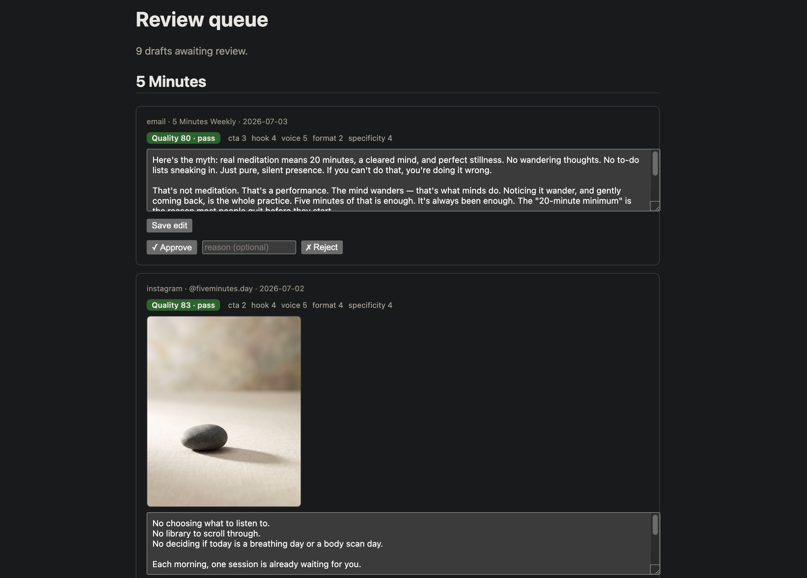

# Marketing Engine

**An autonomous, multi-project marketing pipeline.** One system runs social + content marketing for an entire portfolio of products — each in its own voice, language, and cadence — from brief to published post to tracked result.

> Built on a simple thesis: in 2026 everyone can *build*; almost no one can *distribute*. This is the distribution layer, automated.

## What it does
Every product moves through four stages on a schedule — **Plan → Generate → Publish → Track**:

1. **Plan** — turns a campaign brief into concrete content briefs (theme, angle, channel, cadence).
2. **Generate** — drafts real copy via the Claude API in each product's native voice and language (incl. bilingual EN/AR), then scores every draft on hook, voice, CTA, format & specificity — gating weak ones before they reach human review.
3. **Publish** — pushes approved content to each channel: social via Postiz, email via Resend, blogs as git-committed Markdown.
4. **Track** — pulls per-post metrics back in and reports what's working, feeding the next Plan cycle.

## Design: a project is *data, not code*
Onboarding a product means adding a **brand-kit** (a JSON doc: voice, audience, channels, cadence, guardrails) plus a few rows — no new code. The same engine then markets it natively. One pipeline, N tenants.

Core model:
- `projects` — each product + its `brand_kit` (jsonb), status, default autonomy, timezone
- `campaigns` — time-bound briefs (theme, goal, window) per project
- `channels` — per-project channel config
- `content_items` — generated drafts moving through the pipeline
- `approval_events` — the human-in-the-loop audit trail
- `metrics` — the Track layer

## Safety model: nothing ships unwatched
- **Review autonomy by default** — content is generated but held for human approval; an `auto` mode exists per project once trusted.
- **Real sends are double-gated** — publishing and email require explicit approval, logged in `approval_events`.
- Designed so a high-trust brand (religious or financial) can run gated while a low-stakes one runs fully autonomous.

## In action

*The review queue: each draft is auto-scored on hook, voice, CTA, format & specificity, then held for human approve / edit / reject — nothing publishes unwatched.*

## Stack
Next.js (App Router) · Vercel · Vercel Cron · Neon Postgres + Drizzle ORM · Claude API · Postiz · Resend · TypeScript

## Status
Deployed · **~88 tests** · multi-tenant, 5 products synced · currently running a live day-zero growth campaign on **5 Minutes** — *results updating here.*

---
· built solo by Mohammad Nazari · `mohed.nazari@gmail.com`
