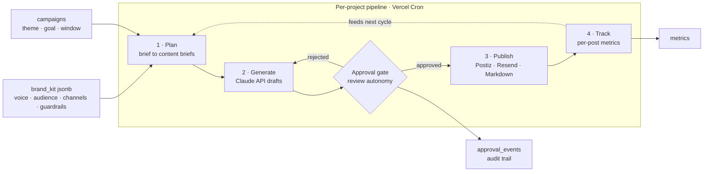

```mermaid
flowchart LR
    BK["brand_kit jsonb<br/>voice · audience · channels · guardrails"] --> P
    CMP["campaigns<br/>theme · goal · window"] --> P
    subgraph PIPE["Per-project pipeline · Vercel Cron"]
        direction LR
        P["1 · Plan<br/>brief to content briefs"] --> G["2 · Generate<br/>Claude API drafts"]
        G --> R{"Approval gate<br/>review autonomy"}
        R -->|approved| PUB["3 · Publish<br/>Postiz · Resend · Markdown"]
        R -->|rejected| G
        PUB --> T["4 · Track<br/>per-post metrics"]
    end
    T -.->|feeds next cycle| P
    R --> AE["approval_events<br/>audit trail"]
    T --> M["metrics"]
```
